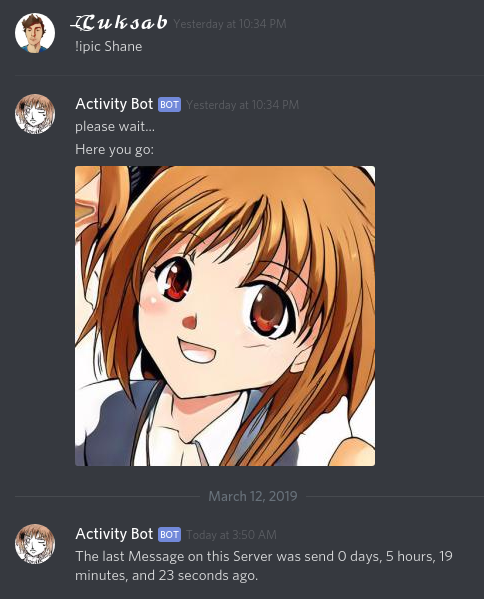

# Activity-Bot
A DiscordBot to show activity of a server

## Setup
### Node.js
* Make a new discord-app and -bot
* Put your discord token and other configuration changes into config.json
* Run index.js with node.js

### Python
* Make sure you can run [styleGAN](https://github.com/NVlabs/stylegan)
* Run ImgFromWebSocket.py in the styleGAN directory
